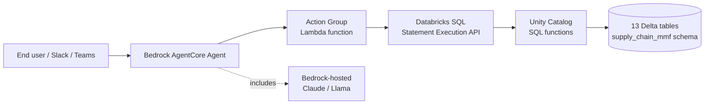

# 07 — Bedrock AgentCore Integration

This document shows how to extend the supply-chain demo with an AWS-side agent built on **Amazon Bedrock AgentCore**, calling into the Databricks Unity Catalog SQL functions (`product_from_raw`, `raw_from_product`, `revenue_risk`) as agent tools.

The integration is intentionally minimal — Unity Catalog SQL functions are the universal tool surface, so the AWS-side glue is small (one Lambda action group + OAuth M2M credentials).

## Why this matters

| | Databricks-native path | AWS-native path (this doc) |
|---|---|---|
| Agent runtime | Mosaic AI Agent Framework on Model Serving | Bedrock AgentCore |
| Tool surface | UC SQL functions, called natively | Same UC SQL functions, called via Databricks SQL REST API |
| Auth | Within Databricks identity boundary | OAuth M2M from AWS account → Databricks workspace |
| Governance | Unity Catalog (lineage, access control, audit) | Unity Catalog (same, enforced at SQL execution time) |
| Best fit | Databricks-standardized customers | Customers standardized on AWS, or using Bedrock for multi-tool orchestration |

Both paths share the same UC tools and produce the same answers. The choice is a deployment / org boundary decision, not a capability one. Joint AWS-Databricks customers should pick based on where the orchestration logic naturally lives.

## Architecture



**Flow:**

1. End user asks a natural-language question to the Bedrock AgentCore agent.
2. AgentCore's reasoning model (Claude on Bedrock) decides which UC SQL function to call.
3. The agent invokes the configured Action Group, which routes the call to a Lambda function.
4. The Lambda function authenticates to Databricks via OAuth M2M and executes a SQL statement that calls the UC function.
5. Results flow back through AgentCore to the user, formatted as natural language.

## Step 1 — Service principal + OAuth M2M credentials

In the Databricks workspace, create a service principal that Bedrock will use:

```bash
# Using databricks-cli; replace YOUR_WS with your workspace host
databricks service-principals create \
  --display-name "bedrock-agentcore-supply-chain" \
  --profile YOUR_WS

# Generate OAuth M2M secret
SP_ID=$(databricks service-principals list --profile YOUR_WS \
  | jq -r '.[] | select(.displayName=="bedrock-agentcore-supply-chain") | .id')

databricks service-principal-secrets create $SP_ID --profile YOUR_WS
# Output: client_id + secret — store both in AWS Secrets Manager
```

Grant the service principal `USE_CATALOG`, `USE_SCHEMA`, `EXECUTE` on the supply-chain schema:

```sql
GRANT USE_CATALOG ON CATALOG main TO `bedrock-agentcore-supply-chain`;
GRANT USE_SCHEMA ON SCHEMA main.supply_chain_mmf TO `bedrock-agentcore-supply-chain`;
GRANT EXECUTE ON FUNCTION main.supply_chain_mmf.product_from_raw TO `bedrock-agentcore-supply-chain`;
GRANT EXECUTE ON FUNCTION main.supply_chain_mmf.raw_from_product TO `bedrock-agentcore-supply-chain`;
GRANT EXECUTE ON FUNCTION main.supply_chain_mmf.revenue_risk TO `bedrock-agentcore-supply-chain`;
GRANT SELECT ON SCHEMA main.supply_chain_mmf TO `bedrock-agentcore-supply-chain`;
```

Store the `client_id` and `client_secret` in AWS Secrets Manager under a known secret name, e.g., `bedrock-agentcore/databricks-supply-chain`.

## Step 2 — Lambda action group function

This Lambda is the bridge between Bedrock AgentCore and the Databricks SQL Statement Execution API. It handles three tool invocations matching the UC functions.

```python
# lambda_function.py
import json
import os

import boto3
import requests

DATABRICKS_HOST = os.environ["DATABRICKS_HOST"]            # e.g., https://my-workspace.cloud.databricks.com
WAREHOUSE_ID = os.environ["DATABRICKS_WAREHOUSE_ID"]       # Pro or Serverless warehouse
CATALOG = os.environ.get("DATABRICKS_CATALOG", "main")
SCHEMA = os.environ.get("DATABRICKS_SCHEMA", "supply_chain_mmf")
SECRET_NAME = os.environ["DATABRICKS_OAUTH_SECRET_NAME"]   # AWS Secrets Manager name


def get_oauth_token() -> str:
    """Fetch OAuth M2M token using Databricks service principal credentials."""
    secrets = boto3.client("secretsmanager")
    secret = json.loads(secrets.get_secret_value(SecretId=SECRET_NAME)["SecretString"])
    client_id = secret["client_id"]
    client_secret = secret["client_secret"]

    token_endpoint = f"{DATABRICKS_HOST}/oidc/v1/token"
    resp = requests.post(
        token_endpoint,
        auth=(client_id, client_secret),
        data={"grant_type": "client_credentials", "scope": "all-apis"},
        timeout=10,
    )
    resp.raise_for_status()
    return resp.json()["access_token"]


def execute_sql(sql: str, parameters: list | None = None) -> dict:
    """Execute a SQL statement via Databricks SQL Statement Execution API."""
    token = get_oauth_token()
    payload = {
        "warehouse_id": WAREHOUSE_ID,
        "statement": sql,
        "wait_timeout": "30s",
        "parameters": parameters or [],
    }
    resp = requests.post(
        f"{DATABRICKS_HOST}/api/2.0/sql/statements",
        headers={"Authorization": f"Bearer {token}"},
        json=payload,
        timeout=60,
    )
    resp.raise_for_status()
    return resp.json()


def format_result(result: dict) -> str:
    """Flatten a SQL Statement Execution result into a Bedrock-friendly text response."""
    status = result.get("status", {}).get("state")
    if status != "SUCCEEDED":
        return f"Query failed: {result.get('status', {}).get('error', {}).get('message', 'unknown error')}"
    rows = result.get("result", {}).get("data_array", []) or []
    schema = result.get("manifest", {}).get("schema", {}).get("columns", [])
    if not rows:
        return "No rows returned."
    header = [c["name"] for c in schema]
    lines = ["\t".join(header)]
    lines += ["\t".join(str(v) if v is not None else "NULL" for v in row) for row in rows[:50]]
    return "\n".join(lines)


def lambda_handler(event: dict, context) -> dict:
    """Bedrock AgentCore action-group invocation handler."""
    action_group = event.get("actionGroup")
    function_name = event.get("function")  # AgentCore passes the tool name
    parameters = {p["name"]: p["value"] for p in event.get("parameters", [])}

    if function_name == "product_from_raw":
        sql = f"SELECT * FROM {CATALOG}.{SCHEMA}.product_from_raw(:raw_material)"
        params = [{"name": "raw_material", "value": parameters["raw_material"], "type": "STRING"}]
    elif function_name == "raw_from_product":
        sql = f"SELECT * FROM {CATALOG}.{SCHEMA}.raw_from_product(:product)"
        params = [{"name": "product", "value": parameters["product"], "type": "STRING"}]
    elif function_name == "revenue_risk":
        sql = f"SELECT * FROM {CATALOG}.{SCHEMA}.revenue_risk(:raw_material)"
        params = [{"name": "raw_material", "value": parameters["raw_material"], "type": "STRING"}]
    else:
        return {
            "messageVersion": "1.0",
            "response": {
                "actionGroup": action_group,
                "function": function_name,
                "functionResponse": {
                    "responseBody": {"TEXT": {"body": f"Unknown function: {function_name}"}}
                },
            },
        }

    result = execute_sql(sql, parameters=params)
    body = format_result(result)

    return {
        "messageVersion": "1.0",
        "response": {
            "actionGroup": action_group,
            "function": function_name,
            "functionResponse": {
                "responseBody": {"TEXT": {"body": body}}
            },
        },
    }
```

**Lambda IAM role** needs:
- `secretsmanager:GetSecretValue` on the Databricks OAuth secret
- VPC access if the Databricks workspace requires private connectivity
- Outbound internet via NAT if not in VPC

**Environment variables:**
- `DATABRICKS_HOST` — workspace URL
- `DATABRICKS_WAREHOUSE_ID` — Pro or Serverless warehouse
- `DATABRICKS_CATALOG`, `DATABRICKS_SCHEMA` — defaults to `main`, `supply_chain_mmf`
- `DATABRICKS_OAUTH_SECRET_NAME` — secret name in AWS Secrets Manager

## Step 3 — Bedrock AgentCore agent configuration

Create an AgentCore agent with one action group exposing the three UC functions as tools.

OpenAPI snippet for the action-group schema (Bedrock auto-generates the tool catalog from this):

```yaml
openapi: 3.0.0
info:
  title: Supply-Chain Risk Tools
  version: 1.0.0
paths:
  /product_from_raw:
    post:
      summary: Given a raw material, return all downstream products that depend on it.
      operationId: product_from_raw
      parameters:
        - name: raw_material
          in: query
          required: true
          schema: { type: string }
          description: MAT number of the raw material (e.g., H7AZR).
      responses:
        "200":
          description: Affected products and per-step BOM quantities.
  /raw_from_product:
    post:
      summary: Given a finished product, return its upstream bill of materials.
      operationId: raw_from_product
      parameters:
        - name: product
          in: query
          required: true
          schema: { type: string }
          description: Product SKU (e.g., syringe_1).
      responses:
        "200":
          description: Upstream raw + intermediate materials with quantities.
  /revenue_risk:
    post:
      summary: For a raw-material shortage, compute the revenue at risk across affected finished products.
      operationId: revenue_risk
      parameters:
        - name: raw_material
          in: query
          required: true
          schema: { type: string }
          description: MAT number of the raw material.
      responses:
        "200":
          description: Per-product revenue-at-risk breakdown.
```

**Agent foundation model:** Claude on Bedrock (3.5 Sonnet or 4.x) works well for this — strong multi-step reasoning, robust tool selection.

**System prompt (suggested):**

```text
You are a supply-chain risk analyst with access to three tools that query a
Databricks Unity Catalog schema:

- product_from_raw(raw_material): returns downstream products affected by a raw-material shortage
- raw_from_product(product): returns the bill of materials for a finished product
- revenue_risk(raw_material): returns revenue at risk per affected product

Workflow for risk questions:
1. Identify the raw material in question. If the user mentions a finished
   product or wholesaler, use raw_from_product first to find the underlying
   raw materials.
2. Call revenue_risk to quantify exposure.
3. Use product_from_raw if the user asks "which products are affected".
4. Always report dollar amounts with thousands separators and currency.

If a question cannot be answered with these three tools (e.g., about
forecasting model internals or shipment recommendations), say so and
suggest using the Genie Space directly.
```

## Step 4 — Sample agent conversations

The same booth-narrative questions from `genie_seed_questions.md` work natively here:

> **User:** Which finished products are at risk if we can't source enough of raw material H7AZR?
>
> *Agent invokes:* `product_from_raw("H7AZR")`
>
> **Agent:** Three products depend on H7AZR: syringe_1 (2 units required per finished SKU through primary material H7AZR_p), insulin_pen_2, and vial_4. Would you like the revenue exposure for each?

> **User:** Yes, please.
>
> *Agent invokes:* `revenue_risk("H7AZR")`
>
> **Agent:** Total weekly revenue at risk is approximately $1,247,000, with syringe_1 accounting for $890,000, insulin_pen_2 for $267,000, and vial_4 for $90,000.

## Step 5 — Extension patterns

Once this base integration is in place, additional layers are straightforward:

- **Slack / Teams front-end.** Bedrock AgentCore supports Slack/Teams connectors. The same agent now answers supply-chain questions from a Slack channel — useful for operations / sourcing teams.
- **Scheduled risk briefs.** EventBridge cron rule → Lambda → AgentCore agent run → SNS / email summary of "revenue at risk this week."
- **Multi-agent orchestration.** Add a second AgentCore agent for vendor / contract context (RAG over PDF SLAs, vendor scorecards), and let AgentCore's planner decide when to call which.
- **MCP server alternative.** The same UC SQL functions can also be exposed as an MCP (Model Context Protocol) server for non-Bedrock agents — Claude Desktop, custom AWS-side agents, third-party LLM platforms — without changing the Databricks side at all.

## When to choose this path vs Mosaic AI Agent Framework

- **Choose Bedrock AgentCore** when: the customer is AWS-standardized, already running Bedrock agents elsewhere, or needs to compose Databricks tools with non-Databricks AWS services (Lambda, Step Functions, EventBridge, SNS) in a single agent runtime.
- **Choose Mosaic AI Agent Framework / Agent Bricks** when: the agent's primary surface is Databricks-native (notebook + Model Serving endpoint), governance and observability tracking should remain inside Unity Catalog + MLflow, or the agent is a building block for a larger Databricks-resident application.
- **Both can coexist.** Many joint AWS-Databricks customers will end up running both — Mosaic AI agents for Databricks-native use cases, Bedrock AgentCore for AWS-resident orchestrations — with Unity Catalog as the shared data + tool layer underneath.

## References

- Databricks SQL Statement Execution API: https://docs.databricks.com/api/workspace/statementexecution
- Databricks OAuth M2M for service principals: https://docs.databricks.com/dev-tools/auth/oauth-m2m.html
- Bedrock AgentCore documentation: https://docs.aws.amazon.com/bedrock/latest/userguide/agents.html
- Unity Catalog SQL functions (already covered in notebook 05): https://docs.databricks.com/sql/language-manual/sql-ref-syntax-ddl-create-sql-function.html
