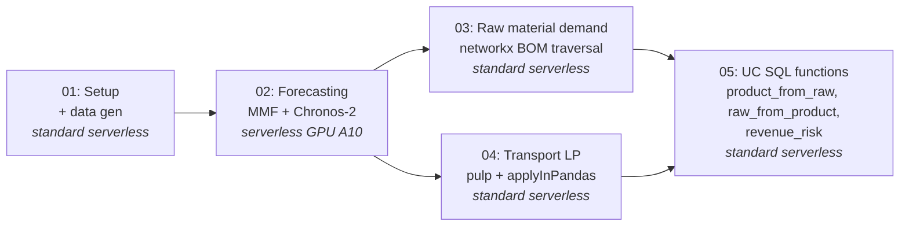

# supply-chain-mmf

An end-to-end **pharmaceutical supply-chain optimization pipeline** on Databricks — demand forecasting → raw-material planning → shipment optimization → AI-agent-ready SQL functions. Built to run **entirely on serverless**, with the forecasting step powered by **AWS AutoGluon's [Chronos-2 foundation models](https://huggingface.co/autogluon/chronos-2)** via [Databricks Many Model Forecasting (MMF)](https://github.com/databricks-industry-solutions/many-model-forecasting).

| | |
|---|---|
| **What it does** | One-week-ahead SKU demand forecasts → raw-material requirements → least-cost shipment plan → SQL functions for an AI agent |
| **What's new** | The forecasting step is **zero-shot** with Chronos-2 (28M and 120M variants) — no per-series training, no AutoARIMA tuning, ~30s of GPU time for 900 series |
| **Performance** | **10.82% mean SMAPE** on 900 weekly time series, zero-shot — competitive with hand-tuned classical models that need 30-60× more compute |
| **Compute** | Serverless throughout. The forecasting notebook needs serverless GPU (A10); everything else runs on standard serverless |

---

## Why this exists

The [original Databricks supply-chain solution accelerator](https://github.com/databricks-industry-solutions/supply-chain-optimization) fits one classical time-series model (ExponentialSmoothing) per (product, wholesaler) series via a pandas-UDF. That works, but on serverless Spark (Spark Connect) the Python workers are CPU-only — so you don't benefit from the GPUs serverless GPU compute makes available, and per-series fitting time scales linearly with the series count.

This repo swaps that out for a **foundation-model approach**: one Chronos-2 model on one GPU, batched across all 900 series at once. Same forecasting interface; ~10× faster wall-clock; SMAPE in the "good" band without any per-series tuning.

It also makes the other four steps of the upstream accelerator **serverless-compatible**, which they weren't out of the box (`graphframes` and `.rdd` calls don't work on Spark Connect — see [Serverless compatibility notes](#serverless-compatibility-notes) below).

## Pipeline at a glance



| # | Notebook | What it produces |
|---|---|---|
| 1 | `01_Introduction_And_Setup` | 6 source Delta tables: `product_demand_historical`, `distribution_center_to_wholesaler_mapping`, `bom`, `plant_supply`, `transport_cost`, `list_prices` |
| 2 | `02_Fine_Grained_Demand_Forecasting` | MMF backtests + scoring tables (`mmf_train`, `mmf_evaluation`, `mmf_scoring`) and the consumer-ready forecast (`product_demand_forecasted`); registers each Chronos-2 variant as a UC model |
| 3 | `03_Derive_Raw_Material_Demand` | `raw_material_demand` (forecasted requirements per raw material) and `raw_material_supply` (synthetic supply caps for the shortage scenario) |
| 4 | `04_Optimize_Transportation` | `shipment_recommendations` — one row per (product, plant, DC) with the optimal `qty_shipped` |
| 5 | `05_Data_Analysis_&_Functions` | Three UC SQL functions: `product_from_raw`, `raw_from_product`, `revenue_risk` |

## Quick start

You'll need a Databricks workspace with **serverless GPU compute** enabled (the only step that needs it is notebook 02). The other notebooks run on standard serverless.

### 1. Add the repo

In the Databricks workspace UI: **Repos → Add Repo → `https://github.com/rohan-parikh-db/supply-chain-mmf.git`**.

### 2. Run notebook 01 (standard serverless)

Set the two widgets:
- `catalog_name` — an existing catalog you have `CREATE SCHEMA` on (default `main`)
- `db_name` — schema name to create (default `supply_chain_mmf`)

This seeds the synthetic dataset. **~3–5 minutes.**

### 3. Run notebook 02 (serverless GPU)

Before running, set the notebook's compute via the *Configuration* tab:

- **Accelerator:** `A10`
- **Environment version:** `5`

Then *Run all*. **~3–4 minutes** including model download. Pass the same `catalog_name` / `db_name` widgets.

### 4. Run notebooks 03, 04, 05 (standard serverless)

Open each, set the widgets, *Run all*. Each completes in under a minute.

### 5. Try it from SQL

```sql
-- Find the most stressed raw material
SELECT RAW, sum(Demand_Raw) - coalesce(sum(supply), 0) AS shortage
FROM main.supply_chain_mmf.raw_material_demand d
LEFT JOIN main.supply_chain_mmf.raw_material_supply s USING (RAW)
GROUP BY RAW
ORDER BY shortage DESC
LIMIT 1;

-- See which products are hit by its shortage
SELECT * FROM main.supply_chain_mmf.product_from_raw('<RAW_id_from_above>');

-- Quantify revenue at risk
SELECT product, sum(revenue_risk) AS revenue_at_risk
FROM main.supply_chain_mmf.revenue_risk('<RAW_id_from_above>')
GROUP BY product;
```

## Forecasting results from a real run

End-to-end on the synthetic dataset (900 weekly series, 4-window rolling backtest, A10 GPU, serverless env v5):

| Model | Params | Mean SMAPE | Notes |
|---|---|---|---|
| Chronos-2-Small | 28M | **0.108** | Default. Fastest. Selected as winner in our run. |
| Chronos-2 (base) | 120M | similar range | Larger model; marginal gains on this dataset, longer inference. |

**0.108 mean SMAPE = ~10.8% error.** For one-week-ahead distribution-style demand forecasting, the rough industry rule of thumb is: <10% excellent, 10–20% good, 20–30% acceptable. This puts a zero-shot foundation model squarely in the "good" band with no per-series tuning.

## Project structure

```
supply-chain-mmf/
├── 01_Introduction_And_Setup.py           # data gen + schema setup
├── 02_Fine_Grained_Demand_Forecasting.py  # MMF + Chronos-2  (needs GPU)
├── 03_Derive_Raw_Material_Demand.py       # networkx BOM traversal
├── 04_Optimize_Transportation.py          # pulp LP + applyInPandas
├── 05_Data_Analysis_&_Functions.py        # UC SQL functions for agents
├── _resources/
│   ├── 00-setup.py                        # catalog/schema bootstrap
│   ├── 01-data-generator.py               # synthetic demand + BOM + transport
│   └── 02-generate-supply.py              # raw-material supply caps
├── LICENSE
└── README.md
```

## Serverless compatibility notes

The upstream accelerator was written for classic Databricks Runtime. The following changes were needed to make every notebook work on serverless (Spark Connect):

| File | Original problem | Fix |
|---|---|---|
| `02_Fine_Grained_Demand_Forecasting` | Statsmodels ExponentialSmoothing in a pandas-UDF — runs on CPU executors only | Replaced with `mmf_sa.run_forecast(active_models=["Chronos2Small", "Chronos2"], accelerator="gpu", serverless=True)`. Set `HF_HUB_ENABLE_HF_TRANSFER=0` and added `hf_transfer` to pip line so HF downloads work either way. |
| `03_Derive_Raw_Material_Demand` | `graphframes.GraphFrame(df)` calls `df.sql_ctx`, removed in Spark Connect | Replaced GraphFrame + `aggregateMessages` with single-node `networkx` traversal (BOM is <100 nodes — single-node is faster anyway). |
| `04_Optimize_Transportation` | `spark.conf.set("spark.databricks.optimizer.adaptive.enabled", "false")` not settable on serverless | Wrapped in try/except. |
| `_resources/00-setup.py` | `dbutils.notebook.entry_point.getDbutils()...getContext().tags().apply('user')` returns None on serverless | Replaced with `spark.sql("select current_user()")`. |
| `_resources/01-data-generator.py` | Same AQE-config issue; `statsmodels`/`matplotlib` not preinstalled on env v5 | Added explicit `%pip install statsmodels matplotlib`; wrapped AQE set in try/except. |
| `_resources/02-generate-supply.py` | `df.rdd.flatMap(...)` — Spark Connect doesn't expose `.rdd` | Replaced with `[r[col] for r in df.collect()]`. |

## Acknowledgments

- Original supply-chain accelerator: [databricks-industry-solutions/supply-chain-optimization](https://github.com/databricks-industry-solutions/supply-chain-optimization)
- Fork adding agentic functions: [lara-openai/databricks-supply-chain](https://github.com/lara-openai/databricks-supply-chain)
- MMF + Chronos integration: [databricks-industry-solutions/many-model-forecasting](https://github.com/databricks-industry-solutions/many-model-forecasting)
- Chronos-2 foundation models: [AWS AutoGluon](https://huggingface.co/autogluon)

## License

Apache 2.0 — see [LICENSE](LICENSE).
