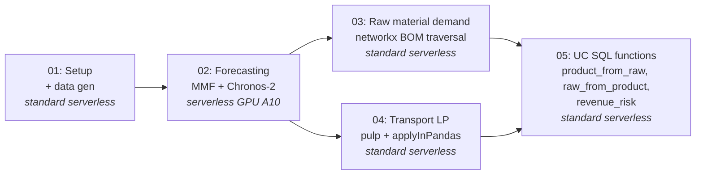

# supply-chain-mmf

An end-to-end **pharmaceutical supply-chain optimization pipeline** on Databricks — demand forecasting → raw-material planning → shipment optimization → AI-agent-ready SQL functions. Built to **showcase two technologies** working together:

🧠 **[Chronos-2](https://huggingface.co/autogluon/chronos-2)** — AWS AutoGluon's pretrained time-series foundation models. Zero-shot, probabilistic, GPU-batched, cross-series transfer learning out of the box.

🛠️ **[Many Model Forecasting (MMF)](https://github.com/databricks-industry-solutions/many-model-forecasting)** — Databricks' forecasting accelerator. Model registry, rolling backtests, multi-model comparison, MLflow tracking, and Unity Catalog model registration — wrapped in one declarative `run_forecast(...)` call.

Both run on **Databricks Serverless** end-to-end (the forecasting step uses serverless GPU; everything else is standard serverless).

| | |
|---|---|
| **Pipeline** | One-week-ahead SKU demand → raw-material requirements → least-cost shipment plan → UC SQL functions for an AI agent |
| **Forecasting accuracy** | **10.82% mean SMAPE** on 900 weekly series, zero-shot — verified end-to-end run |
| **Forecasting wall time** | ~30 seconds on a single A10 GPU for all 900 series |
| **Models showcased** | Chronos-2-Small (28M params) + Chronos-2 base (120M params), evaluated side-by-side |
| **Compute** | Serverless throughout — A10 GPU for forecasting, standard serverless for everything else |

---

## Why Chronos-2 + MMF?

This isn't just "we picked the fast tool." Each piece earns its slot on capability, not convenience.

### Why Chronos-2 (not AutoARIMA, not ExponentialSmoothing)

The [original Databricks supply-chain accelerator](https://github.com/databricks-industry-solutions/supply-chain-optimization) fits one classical model per (product, wholesaler) — 900 independent ExponentialSmoothing fits via a pandas-UDF. That's the standard pattern. What Chronos-2 brings beyond just speed:

- **Zero-shot transfer learning.** Chronos-2 has been pretrained on a massive, diverse corpus of real and synthetic time series. It already knows what trend, seasonality, intermittent demand, and regime shifts look like. AutoARIMA has to relearn all of that from scratch on every single series.
- **Probabilistic forecasts by default.** Each output is a full quantile distribution. Uncertainty bands come from learned outcome distributions, not Gaussian-on-residual assumptions — typically better calibrated, especially on skewed or count-style demand.
- **Cross-series patterns.** Knowledge learned on retail / finance / energy / IoT series in the pretraining corpus carries over to yours. Per-series classical models can't share signal.
- **Robust on short / noisy / non-stationary series.** Classical methods need enough history and a stable distribution. Chronos-2 stays usable on series with <50 points, gaps, sudden volume changes, or regime shifts.
- **One model, batched inference.** All 900 series go through the model in one batched GPU pass instead of 900 independent fits. ~30 seconds on one A10.

### Why MMF (not a hand-rolled wrapper)

`run_forecast(...)` looks like one line, but it's doing real orchestration work — work that would otherwise be 200+ lines you'd write yourself:

- **Model registry.** Pass `active_models=["Chronos2Small", "Chronos2"]` and MMF resolves each name through a YAML config to the right Python class and HuggingFace repo. Want to swap in `TimesFM`, `ChronosBoltBase`, or your own model? One string change.
- **Rolling-window backtest.** Configurable `backtest_length` + `stride` gives you per-series cross-validation metrics — so the forecast quality is defensible with numbers, not vibes.
- **Multi-model comparison out of the box.** Multiple models in one call, all written to the same evaluation table with model tags. Ready for winner-picking, ensembling, or A/B comparison.
- **MLflow + Unity Catalog integration.** Every run is tracked. Every model is registered in UC. Ready for Model Serving and lineage.
- **Serverless GPU adapter.** `accelerator="gpu", serverless=True` is MMF code that picks the right Chronos predict path for Spark Connect (driver-only, because serverless Spark workers are CPU-only).

The point of the repo is that **both technologies show up on their merits**. Chronos-2 produces high-quality probabilistic forecasts with zero per-series tuning; MMF makes them production-shaped (backtests, MLflow, UC) and easy to compare against future model families.

This repo also makes the other four steps of the upstream accelerator **serverless-compatible**, which they weren't out of the box (`graphframes` and `.rdd` calls don't work on Spark Connect — see [Serverless compatibility notes](#serverless-compatibility-notes) below).

## Pipeline at a glance



| # | Notebook | What it produces |
|---|---|---|
| 1 | `01_Introduction_And_Setup` | 6 source Delta tables: `product_demand_historical`, `distribution_center_to_wholesaler_mapping`, `bom`, `plant_supply`, `transport_cost`, `list_prices` |
| 2 | `02_Fine_Grained_Demand_Forecasting` | MMF backtests + scoring tables (`mmf_train`, `mmf_evaluation`, `mmf_scoring`) and the consumer-ready forecast (`product_demand_forecasted`); registers each Chronos-2 variant as a UC model |
| 3 | `03_Derive_Raw_Material_Demand` | `raw_material_demand` (forecasted requirements per raw material) and `raw_material_supply` (synthetic supply caps for the shortage scenario) |
| 4 | `04_Optimize_Transportation` | `shipment_recommendations` — one row per (product, plant, DC) with the optimal `qty_shipped` |
| 5 | `05_Data_Analysis_&_Functions` | Three UC SQL functions: `product_from_raw`, `raw_from_product`, `revenue_risk` |

## Quick start

You'll need a Databricks workspace with **serverless GPU compute** enabled (the only step that needs it is notebook 02). The other notebooks run on standard serverless.

### 1. Add the repo

In the Databricks workspace UI: **Repos → Add Repo → `https://github.com/rohan-parikh-db/supply-chain-mmf.git`**.

### 2. Run notebook 01 (standard serverless)

Set the two widgets:
- `catalog_name` — an existing catalog you have `CREATE SCHEMA` on (default `main`)
- `db_name` — schema name to create (default `supply_chain_mmf`)

This seeds the synthetic dataset. **~3–5 minutes.**

### 3. Run notebook 02 (serverless GPU)

Before running, set the notebook's compute via the *Configuration* tab:

- **Accelerator:** `A10`
- **Environment version:** `5`

Then *Run all*. **~3–4 minutes** including model download. Pass the same `catalog_name` / `db_name` widgets.

### 4. Run notebooks 03, 04, 05 (standard serverless)

Open each, set the widgets, *Run all*. Each completes in under a minute.

### 5. Try it from SQL

```sql
-- Find the most stressed raw material
SELECT RAW, sum(Demand_Raw) - coalesce(sum(supply), 0) AS shortage
FROM main.supply_chain_mmf.raw_material_demand d
LEFT JOIN main.supply_chain_mmf.raw_material_supply s USING (RAW)
GROUP BY RAW
ORDER BY shortage DESC
LIMIT 1;

-- See which products are hit by its shortage
SELECT * FROM main.supply_chain_mmf.product_from_raw('<RAW_id_from_above>');

-- Quantify revenue at risk
SELECT product, sum(revenue_risk) AS revenue_at_risk
FROM main.supply_chain_mmf.revenue_risk('<RAW_id_from_above>')
GROUP BY product;
```

## Forecasting results from a real run

End-to-end on the synthetic dataset (900 weekly series, 4-window rolling backtest, A10 GPU, serverless env v5):

| Model | Params | Mean SMAPE | Notes |
|---|---|---|---|
| Chronos-2-Small | 28M | **0.108** | Default. Fastest. Selected as winner in our run. |
| Chronos-2 (base) | 120M | similar range | Larger model; marginal gains on this dataset, longer inference. |

**0.108 mean SMAPE = ~10.8% error.** For one-week-ahead distribution-style demand forecasting, the rough industry rule of thumb is: <10% excellent, 10–20% good, 20–30% acceptable. This puts a zero-shot foundation model squarely in the "good" band with no per-series tuning.

## Project structure

```
supply-chain-mmf/
├── 01_Introduction_And_Setup.py           # data gen + schema setup
├── 02_Fine_Grained_Demand_Forecasting.py  # MMF + Chronos-2  (needs GPU)
├── 03_Derive_Raw_Material_Demand.py       # networkx BOM traversal
├── 04_Optimize_Transportation.py          # pulp LP + applyInPandas
├── 05_Data_Analysis_&_Functions.py        # UC SQL functions for agents
├── _resources/
│   ├── 00-setup.py                        # catalog/schema bootstrap
│   ├── 01-data-generator.py               # synthetic demand + BOM + transport
│   └── 02-generate-supply.py              # raw-material supply caps
├── LICENSE
└── README.md
```

## Serverless compatibility notes

The upstream accelerator was written for classic Databricks Runtime. The following changes were needed to make every notebook work on serverless (Spark Connect):

| File | Original problem | Fix |
|---|---|---|
| `02_Fine_Grained_Demand_Forecasting` | Statsmodels ExponentialSmoothing in a pandas-UDF — runs on CPU executors only | Replaced with `mmf_sa.run_forecast(active_models=["Chronos2Small", "Chronos2"], accelerator="gpu", serverless=True)`. Set `HF_HUB_ENABLE_HF_TRANSFER=0` and added `hf_transfer` to pip line so HF downloads work either way. |
| `03_Derive_Raw_Material_Demand` | `graphframes.GraphFrame(df)` calls `df.sql_ctx`, removed in Spark Connect | Replaced GraphFrame + `aggregateMessages` with single-node `networkx` traversal (BOM is <100 nodes — single-node is faster anyway). |
| `04_Optimize_Transportation` | `spark.conf.set("spark.databricks.optimizer.adaptive.enabled", "false")` not settable on serverless | Wrapped in try/except. |
| `_resources/00-setup.py` | `dbutils.notebook.entry_point.getDbutils()...getContext().tags().apply('user')` returns None on serverless | Replaced with `spark.sql("select current_user()")`. |
| `_resources/01-data-generator.py` | Same AQE-config issue; `statsmodels`/`matplotlib` not preinstalled on env v5 | Added explicit `%pip install statsmodels matplotlib`; wrapped AQE set in try/except. |
| `_resources/02-generate-supply.py` | `df.rdd.flatMap(...)` — Spark Connect doesn't expose `.rdd` | Replaced with `[r[col] for r in df.collect()]`. |

## Acknowledgments

- Original supply-chain accelerator: [databricks-industry-solutions/supply-chain-optimization](https://github.com/databricks-industry-solutions/supply-chain-optimization)
- Fork adding agentic functions: [lara-openai/databricks-supply-chain](https://github.com/lara-openai/databricks-supply-chain)
- MMF + Chronos integration: [databricks-industry-solutions/many-model-forecasting](https://github.com/databricks-industry-solutions/many-model-forecasting)
- Chronos-2 foundation models: [AWS AutoGluon](https://huggingface.co/autogluon)

## License

Apache 2.0 — see [LICENSE](LICENSE).
